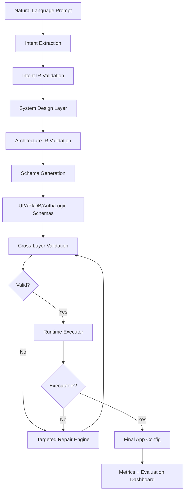

# ConfigForge AI

A Compiler-Style AI App Configuration Generator that converts natural language into a strict, validated, executable application configuration.

## Overview
This is not a prompt engineering wrapper. It is an engineered multi-stage AI platform with reliability, schema control, validation, repair, runtime awareness, and evaluation metrics. It simulates the compilation process for natural language app generation.

## Why Compiler-Style Generation?
Single-prompt generation fails because LLMs struggle to maintain coherence across complex interrelated schemas (DB, API, UI, Auth). A compiler pipeline breaks this into:
1. Intent Extraction
2. Architectural Design
3. Independent Schema Generation
4. Validation & Target Repair

## Tradeoff: Cost vs Quality
- **Fast Mode:** Uses cheaper models, fewer LLM calls, and basic validation. Good for drafting.
- **Quality Mode:** Uses stronger models, full validation, runtime execution proof, and max 3 rounds of targeted repair.

## Setup
1. Clone repository.
2. Copy `.env.example` to `.env` and add your OpenRouter API key.
3. Run `docker-compose up --build`.

## Architecture

